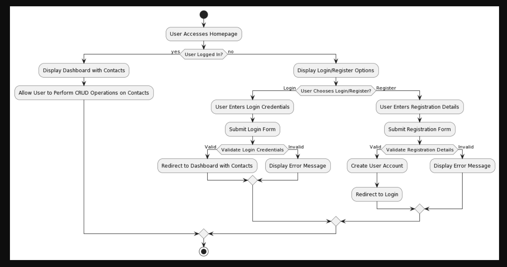
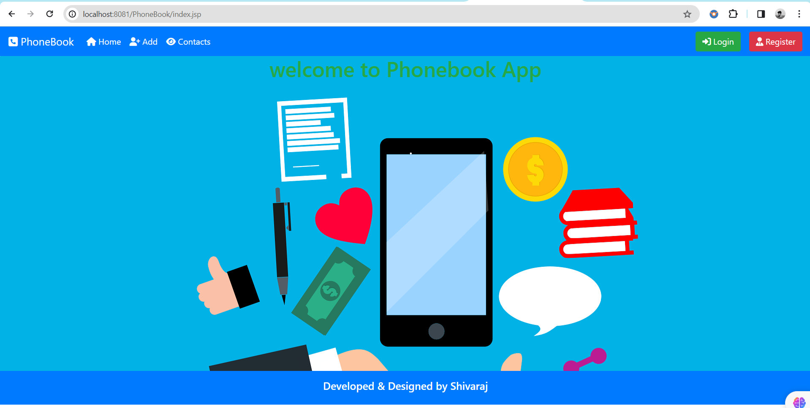
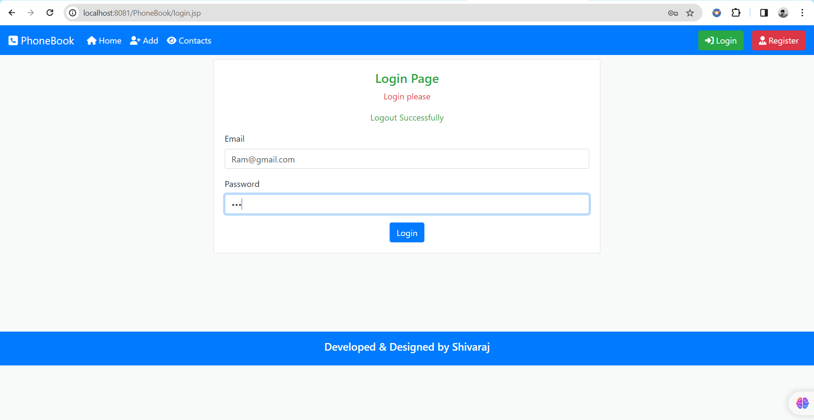
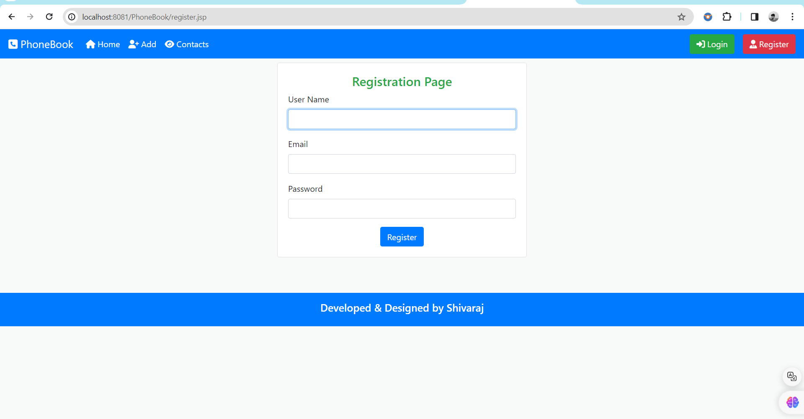
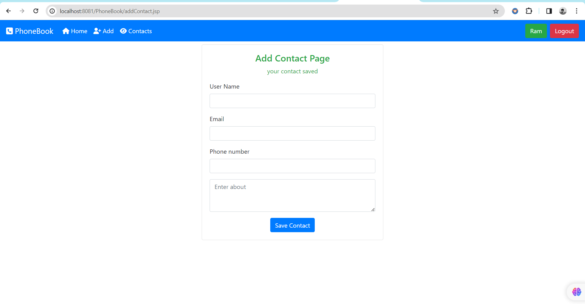
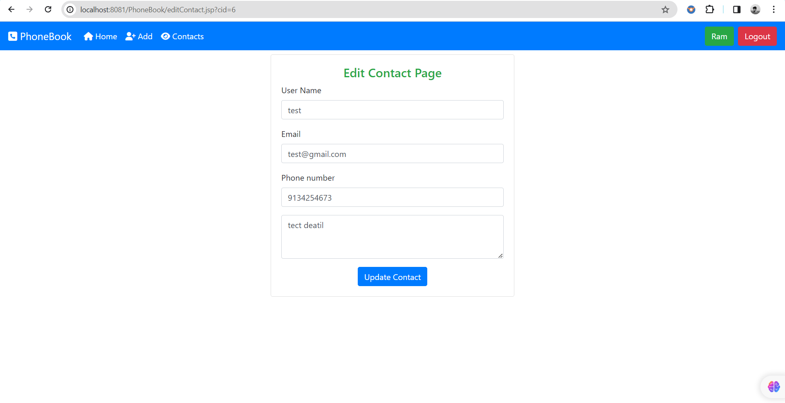
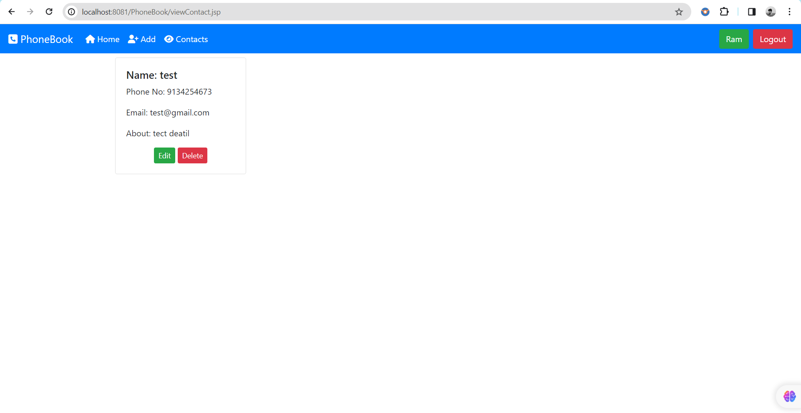

# Phonebook Website

Welcome to the Phonebook Website project! This web application is designed to efficiently manage contacts. Users can register, securely log in, and perform CRUD (Create, Read, Update, Delete) operations on their contacts. The project is built using Java for the backend, MySQL for the database, and Bootstrap for the frontend.

## Table of Contents
- [Features](#features)
- [Tech Stack](#tech-stack)
- [Installation](#installation)
- [Usage](#usage)
- [Project Mind Tree](#project-mind-tree)
- [Project Structure](#project-structure)
- [Screenshots](#screenshots)
- [Contributing](#contributing)
- [License](#license)

## Features

- **User Authentication**: Secure registration and login functionality.
- **Contact Management**: Add, edit, and delete contacts with ease.
- **Responsive Design**: Bootstrap ensures a user-friendly experience across devices.

## Tech Stack

- **Backend**:
  - Java
  - Tomcat Server
- **Frontend**:
  - HTML
  - CSS
  - Bootstrap
  - JavaScript
- **Database**:
  - MySQL

## Installation

1. Clone the repository:
   ```bash
   git clone https://github.com/shivarajkulal/Phonebook-Website.git
   ```

2. Import the project into Eclipse or your preferred IDE.

3. Set up the MySQL database and configure the database connection in the project.

4. Build and deploy the project on a Tomcat server.

## Usage

1. Access the homepage of the application.
2. If you're a registered user, log in securely. Otherwise, register for a new account.
3. Once logged in, you can manage your contacts by adding, editing, or deleting them.


## Project Mind Tree



## Project Structure 

```
.
├── .settings/
├── build/
│   └── classes/
│       └── com/
│           ├── conn/
│           ├── dao/
│           ├── entity/
│           └── servlet/
└── src/
    └── main/
        ├── java/
        │   └── com/
        │       ├── conn/
        │       ├── dao/
        │       ├── entity/
        │       └── servlet/
        └── webapp/
            ├── component/
            ├── image/
            ├── META-INF/
            └── WEB-INF/
                └── lib/
```

## Screenshots

Below are screenshots of some key pages of the Phonebook Website:

| Homepage | Login Page |
|----------|------------|
|  |  |

| Register Page | Add Contact Page |
|---------------|------------------|
|  |  |

| Edit Contact Page | Contact Page |
|--------------------|--------------|
|  |  |


## Contributing

Contributions are welcome! Feel free to open issues or submit pull requests to improve the project.

## License

This project is licensed under the [MIT License](LICENSE).
